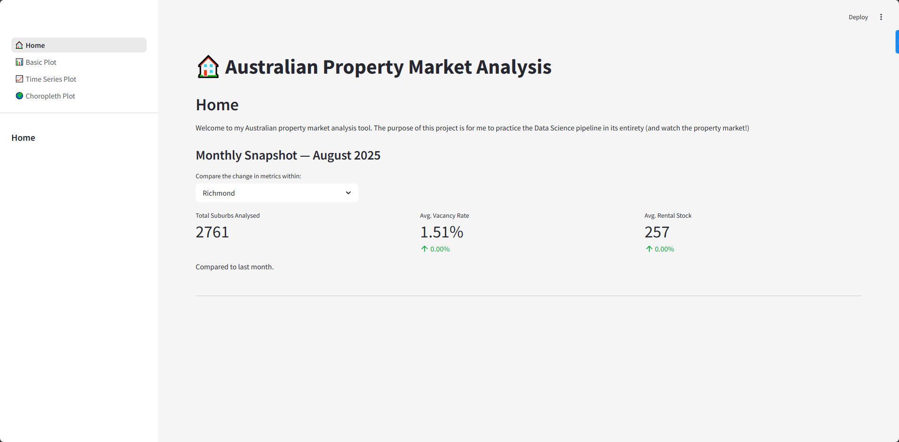
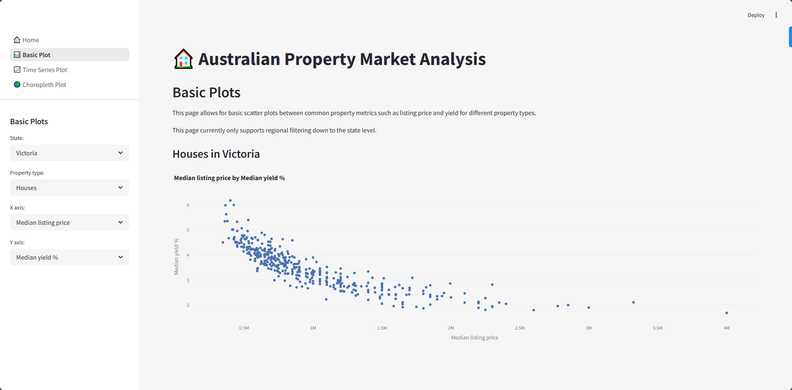

# 🏠 Australian Property Market Analysis App
Welcome to my Australian property market analysis tool. The purpose of this project is for me to practice the Data Science pipeline in its entirety (and watch the property market!)

---

## Table of Contents
- [Skills](#skills)  
- [Motivation](#motivation)  

---

## Skills
What skills I've practiced:  
- Basic web scraping (`Beautifulsoup`)
- Data fusion and EDA (`pandas`, `numpy`, `plotly`)
- Data pipelines & Databases (`mongoDB`)
- Basic web app prototyping (`streamlit`)

---

## Motivation
Recently I have gained interest in the property market. While the REA tools are fantastic, I wanted to build my own visualisations and tools for comparing houses in different suburbs of interest. I decided that this was a good opportunity for me to practice my data science skills.
